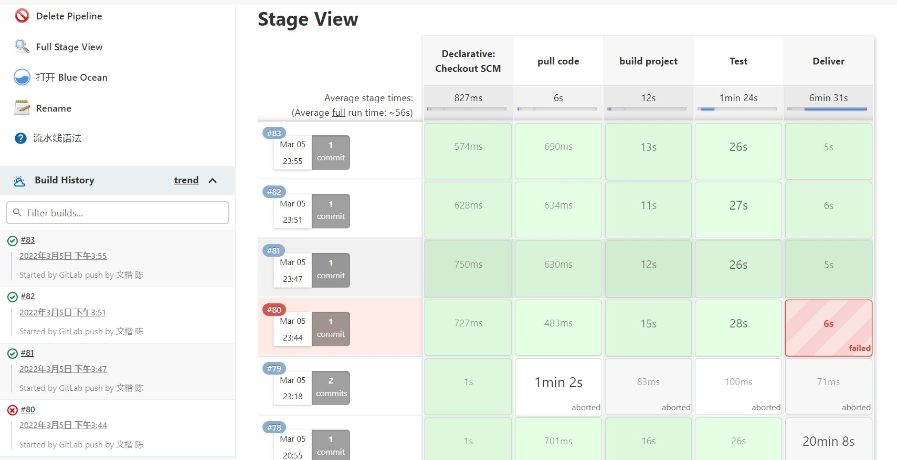
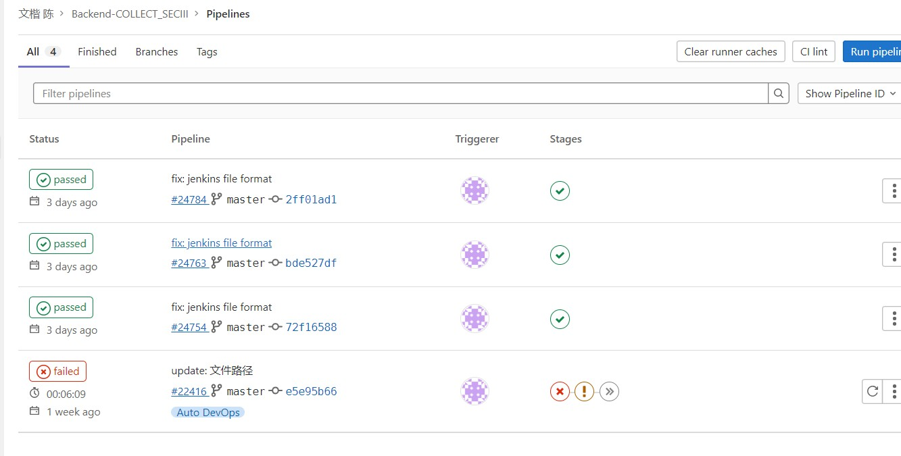

## 项目说明

这是 collect 后端项目，使用了MySQL数据库。

本项目默认使用的 MySQL 用户为 `root` 密码为 `123456`
> 相关配置可参考文件 /src/main/resouces/application.yml `spring.datasource` 字段
> 请根据实际情况进行调整

项目部署前：
> 请使用 /sql/collect.sql 内的脚本初始化数据库和表
（可以直接打开MySQL命令行界面，在登录用户后，将 collect.sql 文件拷贝到命令行后按下回车）

### 部分数据结构说明

项目中使用了 com.github.pagehelper 分页插件，其中 PageInfo 重要的属性如下所示：
```java
public class PageInfo<T> {
    // 当前页码（无论请求中传入的页码数有多大，在返回结果中，pageNum 都是不超过总页数的）
    private int pageNum;
    // 每页包含的最大记录数
    private int pageSize;
    // 当前页包含的记录数
    private int size;
    // 总记录数
    private long total;
    // 总页数
    private int pages;
    // 结果集
    private List<T> list;
    ...
}
```


### 文件说明

SpringBoot 的配置文件可参考 /src/main/resouces/application.yml 以及 代码部分 /src/main/java/team.software.collect/config/*，请根据实际情况调整。
> 目前所有 controller 暴露的 API 都需要添加 /api 前缀才能正常访问，可参考 team.software.collect/config/WebResourceConfig 中 `configurePathMatch` 方法

/src/main/resouces/static 目录下存储了部分课程的图片文件，建议可以将static目录内的图片文件全部拷贝至服务器上传文件的目录（在application.yml定义的）。

/sql/collect.sql 存储了项目初始化需要的sql文件（包含了用于展示的部分数据），初次使用时，可将该文件内的所有sql语句在mysql命令行内执行后初始化数据库。

###  关于推荐的说明
#### 1.任务推荐

管理员可以设置4个参数，我们会根据参数进行加权计算

1. 能力值占比越高，会优先推荐难度值与用户能力值相近的任务
2. 任务类型偏好占比越高，会优先推荐任务类型与用户喜欢的任务类型最匹配的任务
3. 活跃度占比越高，会将越紧急（截止时间越临近）的任务推荐给活跃度越高的用户，让任务更好地按时完成
4. 设备占比越高，会优先推荐设备类型与用户常用设备类型最匹配的任务

关于用户画像：

1. 能力值，随着用户报告质量的提高而提高，随着对所有任务的报告的评分而变化
2. 偏好，用户每接受一个任务就会对任务类型偏好进行更新
3. 活跃度，我们为接受任务、发布报告、发布协作报告等设置了不同的活跃值，每当用户做出相应的行为，活跃度就会进行更新
4. 设备，用户每发布一篇报告就会对设备信息进行更新

此外，项目添加了定时任务，删除不在近一个月内提交的报告对设备偏好的影响，
防止用户长期使用一个设备测试后，转投其他设备（接下来的一段时间都选择用新设备而放弃旧设备）时，很长的时间段内系统仍然认为用户的优先设备是旧设备的情况；
同时，活跃度方面采取了比较简单的处理方式，采用定时任务，每天凌晨活跃值减去0.1，直至减到0

#### 2.报告推荐

1.在用户提交报告后，推荐相似报告，引导用户进行协作

2.用户也可以选择低质量报告进行补充协作

关于报告的相似度：

使用了图片相似度（缺陷截图）与文本相似度结合的方法（加权）进行计算

此外，将报告的抄袭检测放在发报告的接口中，用户上传报告，后台会进行重复度检测


###  Swagger接口文档（knife4j）
本地调试时，后端项目运行后可打开（注意端口号要与配置一致）
http://localhost:8765/doc.html

### 后端 CICD
详细信息参见：Iteration2部署文档

**jenkins**:



**nju.git**：



> * 简要说明：后几次的自动构建，由于 nju.git的维护原因，状态没被 post 到 nju.git
